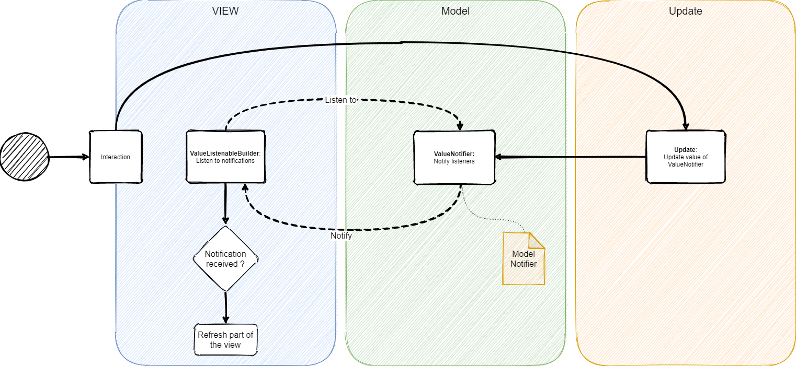

# Flutter MVU

This is just a new approach of using the MVU pattern with Flutter projects. In this approach, simplicity was put in the foreground. 
The implementation in this MVU example is based on the standard Flutter project. The value of the counter is controlled via an update 
and notifier procedure. A detailed description will follow in the next sections.   

## MVU - Architecture



The following figure shows a summary of the logic of this approach. As you can see, the interaction is the triggering point for the whole process.
This could be a button click event or something similar. After triggering an event from the view scope, the update delivers this
to the notifier in the model scope by incrementing the value of the counter. Through the ValueListenableBuilder of the Flutter library, 
it is possible to build the observer pattern between **View <> Model**. This results in the widget being updated with the current counter value.

So, that's the theory. Now we're going to introduce the approach step by step.

## Register the components

It's highly recommended to use this approach with the help of **DI (Dependency Injection)**. Here I use for simplicity the [GetIt Library](https://pub.dev/packages/get_it).
But feel free, and adapt your business with the DI-Library of your choice. 

As you can follow in [bootstrapper.dart](./lib/core/bootstrapper.dart), you've deal with registering the necessary components in the container

```dart
    final counterNotifier = CounterModelNotifier(CounterModel(0));
    di.registerSingleton(counterNotifier);

    final counterUpdate = CounterUpdate(counterNotifier);
    di.registerSingleton(counterUpdate);
```
We're registering here the necessary **notifier <> update** components. The `counterNotifier` in the code above extends the `ValueNotifier` from the flutter
library. This delivers the notification, indicating that an update is in process. In addition, the `counterUpdate` gets a reference to the notifier. As mentioned before, you can imagine updates as event handlers, triggering the notification process through updating the values in the notifiers.

In this sample, the **bootstrapper** is the starting point of the registrations. Here you are on your own to use an approach for registration of your choice.
After that, execute the registration in the main entry point:

```dart
void main() {
  final di = Bootstrapper().init();
  runApp(MyApp(di));
}
```
Now we can take off with MVU.

## The notification process

The update process in the code takes place in the following file [counter_update.dart](./lib/core/update/counter_update.dart)

```dart
void incrementCounter() {
_modelNotifier.value = CounterModel(_modelNotifier.value.count + 1);  
}
```
The execution point of `incrementCounter` is the place, where the `FloatingActionButton` is pressed:

```dart
floatingActionButton: FloatingActionButton(
    onPressed: update.incrementCounter,
    tooltip: 'Increment',
    child: Icon(Icons.add),
)
```
But how the widget get informed about the notification ? Go on! and read the next section :)

## The update of the value in the widget

Thanks to the `ValueListenableBuilder` from the Flutter library, it's possible to get tie up all components together.
In the sample code [main.dart](./lib/main.dart) `ValueListenableBuilder` is used at the place, where the text of the counter value is displayed. 
Please pay **Attention!** Only this place will be updated:

```dart
ValueListenableBuilder<CounterModel>(valueListenable: modelNotifier, builder: (context, model, widget) {
    return Text(
        modelNotifier.value.count.toString(),
        style: Theme.of(context).textTheme.headline4,
    );
})
```

For further details, please check the source code and don't hesitate to send your feedback, if you've some ideas or questions. 